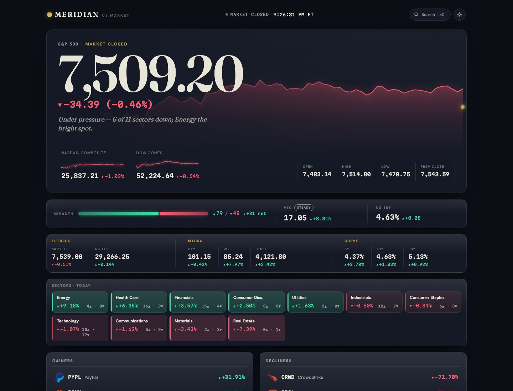

# World Asset Prices

> The top 15 of every major market — stocks, ETFs, crypto, FX, private companies, and commodities — ranked by market cap, with live prices and honest, per-segment data provenance. No API key required.


**🔗 [Live demo → world-asset-prices.vercel.app](https://world-asset-prices.vercel.app)**

[](https://world-asset-prices.vercel.app)

<sub>Screenshot of the current build. To refresh it: `npm run dev`, open `http://localhost:5188` in dark mode at 1440px, and save a viewport capture to `docs/screenshot.jpg`.</sub>

---

## Who it's for

- **Finance learners** who want a multi-asset snapshot without building an account somewhere
- **Developers** who want a real-world example of a resilient no-key data pipeline
- **Recruiters** assessing production-quality frontend/backend engineering

---

## Tech Stack

| Layer | What |
|---|---|
| Frontend | React 19, TypeScript 5.9, Vite 7 |
| Styling | Tailwind CSS v4 + custom CSS tokens (dark-glass design) |
| State | TanStack React Query 5 |
| Backend | Vercel Serverless Functions, Node 24 |
| Data | CoinPaprika, Stooq, Yahoo Finance, Frankfurter/ECB, curated JSON manifest |
| Cache | In-memory TTL → optional Upstash KV → bundled fallback JSON |
| Testing | Vitest 4, Testing Library, Playwright |

---

## Installation

```bash
git clone https://github.com/coleyrockin/world-asset-prices.git
cd world-asset-prices
npm install
npm run dev
```

App runs at `http://localhost:5188`. No `.env` needed — all environment variables are optional overrides.

Optional vars (copy `.env.example`):

| Variable | Purpose | Default |
|---|---|---|
| `CACHE_TTL_SEC` | Fresh cache window | `30` |
| `FALLBACK_TTL_SEC` | Stale cache window | `600` |
| `KV_REST_API_URL` / `KV_REST_API_TOKEN` | Upstash KV durable cache | unset |
| `LOGO_PROXY_*` | Logo proxy host allowlist and limits | see `.env.example` |

Provider URL vars (`COINPAPRIKA_BASE_URL`, `STOOQ_BASE_URL`, etc.) override the upstream origin for testing — must be exact HTTPS origins.

---

## Usage

```bash
npm run dev          # dev server + local API middleware
npm run check        # full release gate: lint, typecheck, tests, build, bundle
npm run audit:data   # validate curated values, sort order, ETF methodology
npm run test:e2e     # Playwright smoke tests
npm run verify:production  # check live site health, CSP, rankings, data
```

Key behaviors:
- **cmd+K** or **/** opens the global search modal — fuzzy match across all 90+ assets
- Click any card to open the detail drawer (provenance, source link, historical chart for stocks/ETFs)
- Pin any card to the Watchlist via the pin icon
- Portfolio Lab (bottom of page) simulates tradable holdings locally — nothing sent to the server
- Theme toggle in the top-right; system preference respected on first load

---

## Resilient by design

The dashboard never shows a blank screen, even when everything upstream is down. Data degrades through four tiers, and the UI labels exactly which one you're seeing:

```
1. Live providers      CoinPaprika · Stooq · Yahoo · Frankfurter   (server, per-request timeouts + retry)
        │ any segment fails ↓
2. Durable cache       Upstash KV — last good payload, TTL-bounded  (server)
        │ unset / expired ↓
3. Bundled fallback    server/fallback/dashboard-fallback.json      (ships in the deploy, always present)
        │ API route unreachable (offline / outage) ↓
4. Client last-known-good   localStorage snapshot from the last visit  (browser)
```

Tiers 1–3 are server-side; tier 4 is what lets a **cold, fully-offline load** still paint real (clearly-aged) data. Every segment is resolved independently, so a crypto outage never blanks the stock table.

## Data model

Every API response segment carries a `source` field: `live`, `fresh-cache`, `stale-cache`, `durable-cache`, or `fallback`. The hero shows a summary; section headers show per-segment age. When a provider fails, the UI is honest about it — no silent stale data.

Private-company valuations (`server/data/asset-value-sources.json`) are curated verified marks with source URLs and `valueAsOf` dates, not live prices. The audit script enforces this and checks age.

---

## Contributing

1. `npm run check` must be green before any PR
2. `dashboard-fallback.json` is bot-owned — never edit it incidentally; use a dedicated data commit
3. New API payload fields are additive only; removals need a version bump
4. Keep the bundle under 300 KB gz (`npm run check:bundle`)
5. Match neighboring file conventions before writing new code

---

## Project structure

```
world-asset-prices/
├── api/              Vercel serverless endpoints
├── server/           Providers, cache, schema, curated data, fallback logic
├── src/              React app — components, hooks, lib, styles
├── tests/e2e/        Playwright smoke tests
├── scripts/          Audit and verification scripts
├── vercel.json       Production routing and security headers
└── package.json
```

---

## License

MIT © Boyd Roberts
